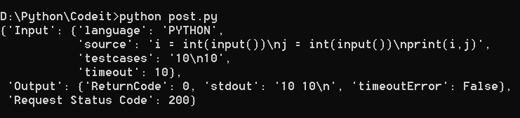

# Code Compiler API - Documentation
**Introduction:**<br>
The Code Compiler API is developed for the developer community and can be used to build online code compilers. This can be used with any Frontend Technology.<br>
Currently, the API supports three languages mainly __C, C++, and Python__. The support for other languages will be added soon.<br>
The REST-API is built using the combination of the latest technologies named __Python, Flask, Flask-Restful API, subprocess, and OOPS concepts__.<br>
The production version is deployed to __Heroku__ and can be accessed at [here](https://flask-compiler-api.herokuapp.com).<br>
<br>

**Using API:**<br>
1. The API uses __POST method__ for code compilation and the endpoint for compilation is https://flask-compiler-api.herokuapp.com/execute/v2/.
2. The data required for compilation is __source code, language, input, and timeout__.
3. You must name languages in this format *C-> C, C++ -> CPP and Python -> PYTHON* while sending a request.
4. The datatypes of the post data must be *source: str, language: str, input: str and timeout: int*.
5. Example Input: <br>
```{source: 'i = int(input())\nj = int(input())\nprint(i,j)', language: 'PYTHON', testcases: '10\n10', timeout: 10}```
6. Example Output: <br> 
```{'Input': {'language': 'PYTHON', 'source': 'i = int(input())\nj = int(input())\nprint(i,j)', 'testcases': '10\n10', 'timeout': 10}, 'Output': {'ReturnCode': 0, 'stdout': '10 10\n', 'timeoutError': False}, 'Request Status Code': 200}```
7. You can use Postman or simply execute post.py file and make edits accordingly.

**Output:**<br><br>


**Installing in your Local System:**
1. The installation is only supported on _*Linux Based Machines*_ and doesn't support _*Windows OS*_.
2. [Python](https://www.python.org/downloads/) must be installed in order to execute the API. Clone the repo using <br>
```git clone https://github.com/omcoolkarni22/compiler-api.git```
3. Install the requirements.txt file using command <br>
```pip install -r requirements.txt```
4. Once you are ready with installed requirements, you can directly execute <br>
```python app.py``` or use flask environment variable ```export FLASK_APP=app``` and ```flask run```
6. The above command will start a development server on localhost port: 5000 and the app will be ready for use.

**P.S.:** <br>
1. GET methods are not supported by any means.
2. You can add more languages of your choice.

*Contributors* are welcomed!
